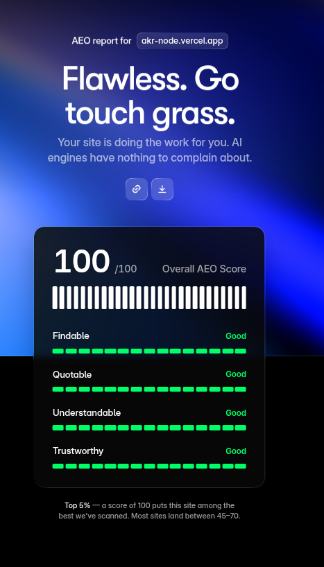

  

  # 🪄 AKR-Inspo Design Skill

  **An intelligent AI agent skill for flawless UI/UX implementation and design pattern integration.**

  

    
    
    
    
    
  

  [Live Preview of Design System](https://akr-inspo.vercel.app/) • [Live Site](https://akr-node.vercel.app)

---

## 🌟 Overview

The **AKR-Designperfection-Skill** is an advanced AI agent prompt that adapts proven UI patterns, layouts, and animations from [AKR-Inspo](https://github.com/ajaykumarreddy-k/AKR-Inspo) (and React Bits) into production-ready components. 

It seamlessly matches your current tech stack, respects your brand guidelines, and strictly enforces modern design principles to ensure a high-quality, aesthetic, and fully functional outcome.

---

## ✨ What it Does

- 🧩 **Smart Component Pulling:** Dynamically fetches UI reference components, animations, and full-site designs.
- 🏗️ **Integrated Scaffolding:** Pairs with `bun create akr` to scaffold projects using a top-300 reference design and tailored font pairing.
- 🎨 **Anti-Slop Design Taste:** Layers in `Leonxlnx/taste-skill` rules (e.g., proper spacing, high contrast, elegant typography).
- 🔍 **SEO/AEO/GEO Audits:** Runs comprehensive discoverability audits and implements fixes (ONLY when explicitly requested).
- 📝 **Self-Documenting:** Automatically writes and updates `akr-design.md` in the root folder, explaining exactly *what* changed and *why*.

---

## 🏆 AEO Score Achievement

This skill's AEO audit capabilities helped achieve a **perfect 100/100 AEO score** on the Akr landing site — placing it in the **Top 5%** of all sites scanned worldwide.

  

| Category | Status |
|----------|--------|
| 🔍 **Findable** | ✅ Good |
| 💬 **Quotable** | ✅ Good |
| 🧠 **Understandable** | ✅ Good |
| 🛡️ **Trustworthy** | ✅ Good |

> *"Flawless. Go touch grass. Your site is doing the work for you. AI engines have nothing to complain about."*  
> — AEO Report for [akr-node.vercel.app](https://akr-node.vercel.app)

---

## 🎯 When to Use It (Triggers)

### ✅ DO Trigger For:
- UI implementation and component generation.
- Full site or specific page redesigns.
- Micro-interactions and complex animation requests.
- Project scaffolding (`bun create akr`).
- Explicit SEO, AEO, or GEO audit requests.

### ❌ Do NOT Trigger For:
- General, open-ended design discussions.
- Providing purely verbal feedback on existing UI.
- Subjective color-palette debates without implementation.
- Standard frontend debugging (where no redesign or UI build is asked for).

---

## ⚙️ Workflow Overview

When invoked, the skill follows a closed **DISCOVER → PLAN → EXECUTE → VERIFY → DONE** loop:

1. **Step 0 — Gate:** Scans project structure (depth 3), reads PRD/README. Asks if requirements are unclear. *Never writes code without understanding the requirements.*
2. **Step 1 — Bootstrap:** During `bun create akr`, scaffolds a minimal runnable base and injects a matching reference design + font pairing.
3. **Step 2 — Taste Rules:** Applies the AKR Identity Layer (dark mode first, Apple-level spacing, WCAG AA minimum). Runs the **AI-Slop Detector** + cross-checks `akr-design/references/anti-patterns.md`. Prints a Taste Checklist before proceeding.
4. **Steps 2.5–2.6c — World Engine:** Mandatory for full builds. Derives: Concept → Brand Personality → Metaphor → Narrative → Signature Object → Section Intelligence → Component Intelligence → Typography → Palette → Design Tokens → Three Creative Directions. Picks the winner. No code until this is done.
5. **Step 3 — Browse References:** Uses GitHub Contents API to fetch AKR-Inspo (layout/structure) + React Bits (micro-interactions). Checks bundled `akr-design/` library first — no fetch needed.
6. **Steps 4–6 — Map, Read, Confidence:** Maps request to the right reference folder, reads matched component fully, states confidence level before touching the project.
7. **Step 7 — Implement:** Integrates code reskinned to the winning palette+token system. Enforces: CSS specificity, copy quality, common-error grep, spacing rhythm, interaction states, density stress test. Performance budget: Lighthouse 90+, CLS<0.1, LCP<2.5s.
8. **Step 8 — SEO/AEO/GEO (Opt-in only):** Implements robots.txt, sitemap.xml, llms.txt, JSON-LD, canonical tags, OG tags — only when explicitly requested.
9. **VERIFY — Quality Gate:** Independent re-read of the built output. Scores 8 dimensions /10. Average <8.5 = not done, loop back to Step 2.6c with a genuinely new direction.
10. **Step 9 — `akr-design.md`:** Finalizes by writing/updating `akr-design.md` at the project root — provenance, concept summary, section list, typography/palette systems, confidence level, VERIFY score, iteration count.

---

## ⚖️ Reference Priority

When multiple design sources or instructions conflict, the skill prioritizes in this exact order:

1. 🥇 **Existing Project Codebase** (Don't break what works)
2. 🥈 **Existing Brand / Design System**
3. 🥉 **Bundled `akr-design/` Library** (tokens, anti-patterns, accessibility, components, mobile, graphic/print, asset scripts — always available, no fetch needed)
4. 🏅 **AKR-Inspo Component Library** (GitHub Contents API, layout/structure reference)
5. 🎖️ **React Bits Library** (micro-interactions, text/scroll/hover animations)
6. 🏵️ **Taste-skill Rules** (`Leonxlnx/taste-skill`, deep design principles)
7. 🛠️ **Original Implementation** (Build fresh if nothing fits)

 

  <i>Perfecting UI, one component at a time — and optimizing for the AI-first web.</i>

